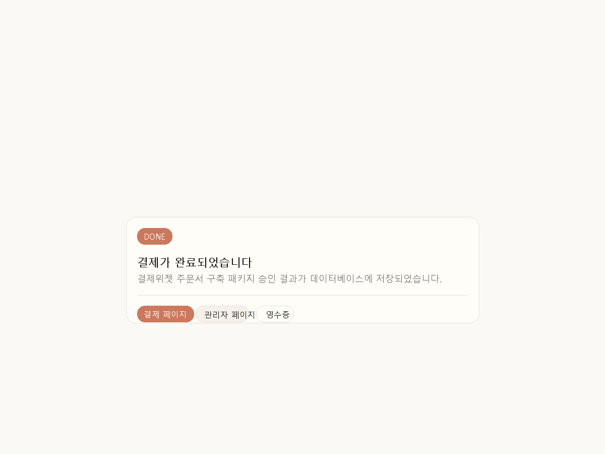
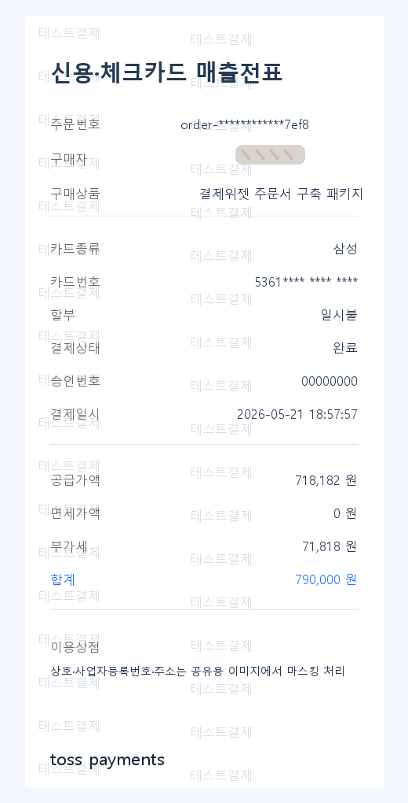
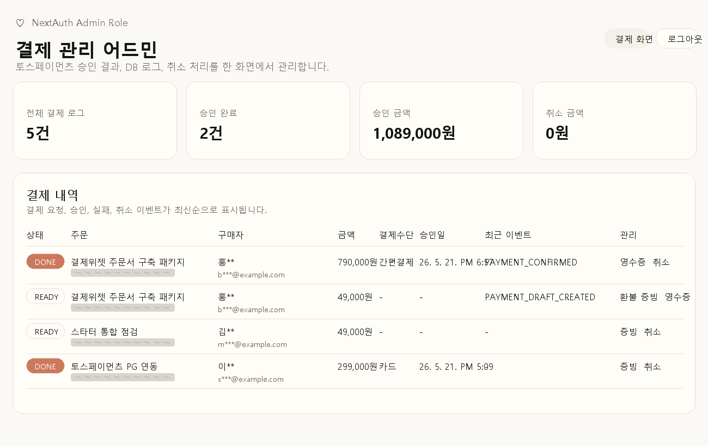
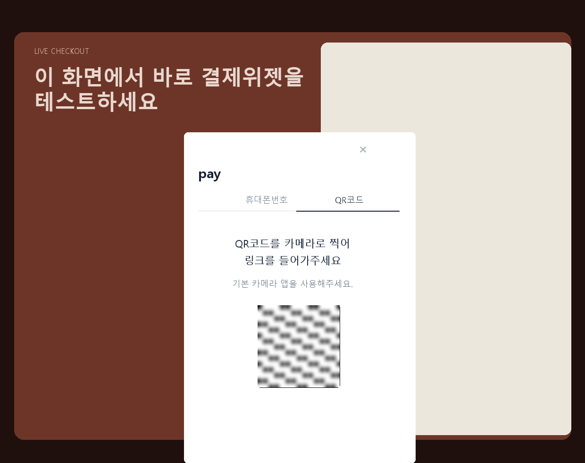
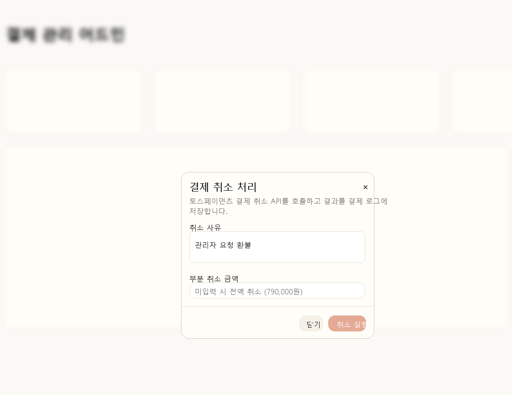
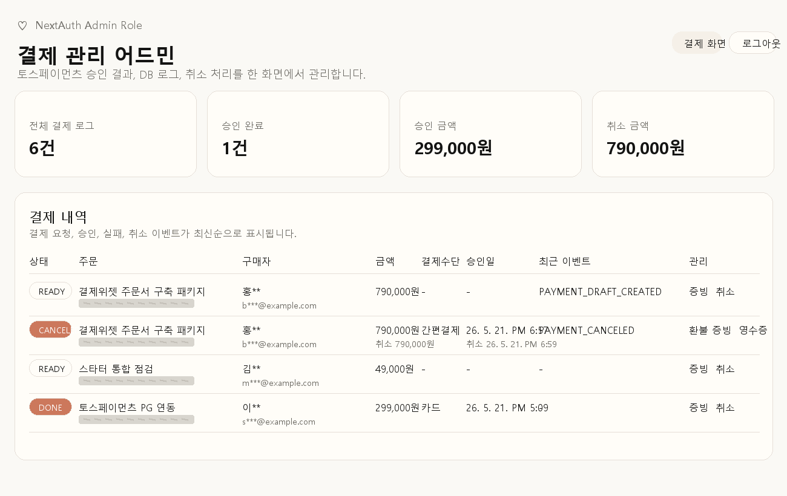
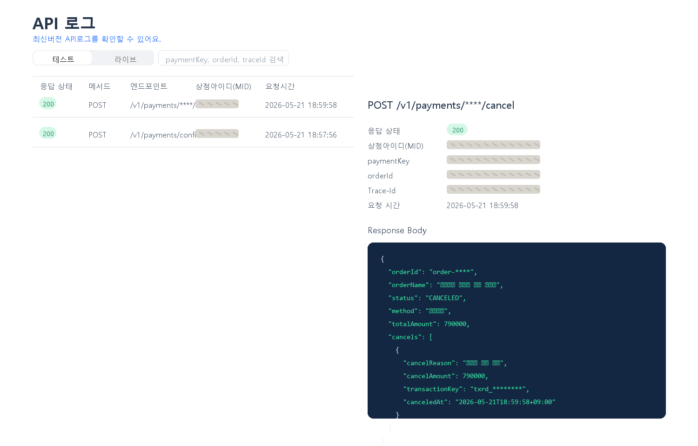
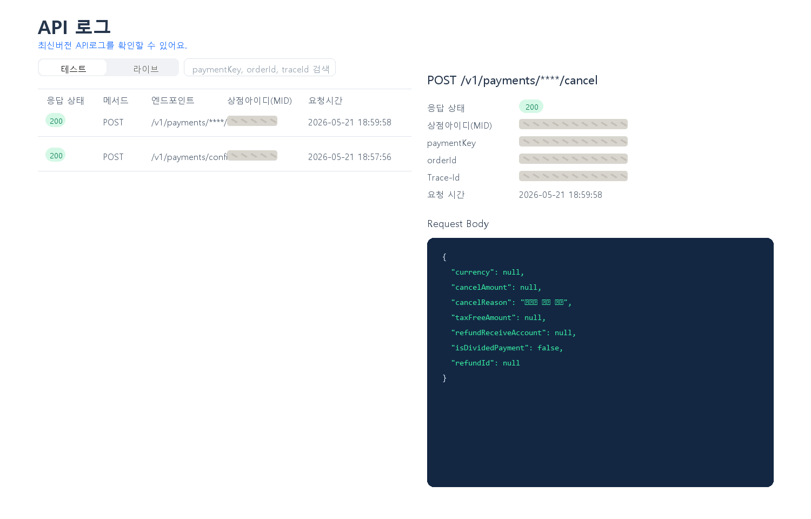

# Toss Ops Studio

Next.js 15, Prisma ORM, PGlite, NextAuth, shadcn/ui로 만든 토스페이먼츠 PG 연동 및 결제 관리 어드민 목업입니다. 위시켓 제안용으로 “결제 상품 선택 → Toss Payments 결제위젯 → 서버 승인 → DB 로그 저장 → 관리자 결제 조회 → 관리자 환불”까지 한 흐름으로 확인할 수 있게 구성했습니다.

GitHub 저장소: https://github.com/nohsangwoo/Toss_Ops_Studio_ex.git

## 핵심 구현

- Next.js 15 App Router 기반 PC Web 목업
- Prisma ORM 6.10 + PGlite 로컬 PostgreSQL 호환 DB
- Toss Payments V2 SDK 결제위젯 연동
- 서버 라우트 기반 주문 초안 생성, 결제 승인, 결제 실패 처리
- `TOSS_PAYMENTS_SECRET_KEY` 기반 서버 승인 API 및 취소 API 호출
- NextAuth Credentials 기반 관리자 로그인 및 `ADMIN` Role 보호
- 결제 내역, 승인/취소 합계, 영수증 링크, 환불 증빙 모달 제공
- OpenAI 이미지 생성 모델로 상품 비주얼 에셋 제작
- `docs/claude_design.md` 컨셉을 반영한 크림/코랄/다크 톤 리디자인

## 기술 스택

- Next.js 15.5.18
- React 19
- TypeScript
- Tailwind CSS v4
- shadcn/ui
- lucide-react
- Prisma ORM with PGlite driver adapter
- PGlite embedded PostgreSQL
- NextAuth v4 Credentials
- Toss Payments V2 JavaScript SDK
- Toss Payments REST API

## 실행 방법

```bash
npm install
npm run db:generate
npm run db:push
npm run db:seed
npm run dev
```

개발 서버:

```text
http://localhost:3000
```

관리자 페이지:

```text
http://localhost:3000/admin/payments
```

데모 관리자 계정:

```text
admin@example.com / admin1234
```

## 환경 변수

`.env` 파일에 아래 값을 설정합니다. 실제 키는 커밋하지 않습니다.

```env
NEXT_PUBLIC_TOSS_PAYMENTS_CLIENT_ID=
TOSS_PAYMENTS_SECRET_KEY=
OPEN_API_SCRET_KEY=
DATABASE_DIR=./.pglite
NEXTAUTH_URL=http://localhost:3000
NEXTAUTH_SECRET=local-nextauth-secret-for-wishket-mockup
ADMIN_EMAIL=admin@example.com
ADMIN_PASSWORD=admin1234
```

운영 또는 외부 공유 전에는 `NEXTAUTH_SECRET`, `ADMIN_PASSWORD`, Toss 키를 반드시 교체하세요.

## 주요 페이지

| 경로 | 설명 |
| --- | --- |
| `/` | 상품형 결제 랜딩, 상품 카드, 결제위젯 데모 |
| `/products/pg-integration` | PG 연동 패키지 상세 |
| `/products/payment-widget` | 결제위젯 주문서 구축 패키지 상세 |
| `/products/admin-operations` | 결제 운영 어드민 패키지 상세 |
| `/payments/success` | Toss success URL 처리, 서버 승인, DB 저장 |
| `/payments/fail` | 실패/중단 결과 저장 |
| `/login` | 관리자 로그인 |
| `/admin/payments` | 관리자 결제 관리 대시보드 |

## 결제 진행 흐름

1. 사용자가 홈 또는 상품 상세 페이지에서 상품을 확인합니다.
2. 결제위젯 주문서가 `NEXT_PUBLIC_TOSS_PAYMENTS_CLIENT_ID`로 Toss SDK를 로드합니다.
3. `tossPayments.widgets({ customerKey })`로 결제위젯을 초기화합니다.
4. 상품 금액을 `widgets.setAmount({ value, currency: "KRW" })`로 동기화합니다.
5. `renderPaymentMethods`, `renderAgreement`로 결제수단과 약관 UI를 렌더링합니다.
6. 결제 요청 전 `/api/payments/prepare`에서 DB에 `READY` 주문 초안을 생성합니다.
7. `widgets.requestPayment()`로 Toss 결제 인증을 시작합니다.
8. 성공 URL `/payments/success`에서 서버가 DB 저장 금액과 URL 금액을 비교합니다.
9. 서버가 `POST /v1/payments/confirm`을 호출하고 승인 결과를 DB에 저장합니다.
10. 관리자 페이지에서 결제 상태, 매출전표, 이벤트 로그를 확인합니다.

## 환불 및 증빙 흐름

관리자는 `/admin/payments`에서 `DONE` 또는 잔액이 남은 `PARTIAL_CANCELED` 결제를 취소할 수 있습니다.

1. `취소` 버튼을 눌러 취소 사유와 부분 취소 금액을 입력합니다.
2. 금액을 비우면 전액 취소, 금액을 입력하면 부분 취소로 요청합니다.
3. 서버 액션이 `POST /v1/payments/{paymentKey}/cancel`을 호출합니다.
4. Toss 응답의 `cancels` 배열을 기준으로 누적 취소 금액을 계산합니다.
5. DB에 `status`, `canceledAmount`, `cancelReason`, `canceledAt`, `rawResponse`, 이벤트 로그를 저장합니다.
6. 어드민 테이블에서 취소 금액과 취소일을 바로 확인합니다.
7. `환불 증빙` 모달에서 취소 거래별 금액, 사유, 일시, `transactionKey`, Trace ID, 매출전표 링크를 확인합니다.

토스페이먼츠 공식 문서 기준으로 결제 취소 성공 시 별도 “환불 영수증 URL”이 따로 내려오기보다는 `Payment.cancels` 배열에 취소 객체가 추가됩니다. 각 취소 거래는 `transactionKey`로 구분됩니다. 그래서 이 목업은 기존 매출전표 링크와 취소 응답 객체를 함께 보여주는 “환불 증빙” 모달을 제공합니다.

참고:

- https://docs.tosspayments.com/guides/v2/cancel-payment
- https://docs.tosspayments.com/reference

## 첨부 스크린샷 기준 진행 상황

첨부 이미지 기준으로 아래 흐름까지 확인했습니다. README에는 원본이 아니라 민감 정보를 마스킹한 문서용 이미지를 포함했습니다.

- 결제 성공 페이지에서 `DONE` 상태와 영수증/관리자 페이지 이동 버튼 노출



- Toss 테스트 매출전표에서 주문번호, 구매자, 상품명, 카드 승인 정보 확인



- 관리자 대시보드에서 승인 결제 추가 및 합계 반영



- 결제위젯에서 QR/간편결제 인증 UI 노출



- 관리자 취소 모달에서 취소 사유와 부분 취소 금액 입력



- 취소 후 관리자 대시보드에서 `CANCELED`, 취소 금액, `PAYMENT_CANCELED` 이벤트 반영



- Toss 개발자센터 API 로그에서 `/confirm`, `/cancel` 호출과 응답 확인





## 스크린샷 공개 전 마스킹 기준

첨부 스크린샷을 README, 제안서, 외부 문서에 넣을 때는 아래 항목을 모자이크 또는 블러 처리하세요.

- 결제위젯 QR 코드 전체
- `paymentKey`
- `transactionKey`, `lastTransactionKey`
- `X-TossPayments-Trace-Id`
- `orderId` 전체 또는 뒷자리 일부
- 상점아이디 MID
- 카드번호 뒷자리 포함 카드 식별값
- API Response Body, Request Body의 식별자 값
- 실제 구매자명, 이메일, 전화번호가 들어간 경우 전체
- 실제 사업자등록번호, 주소, 대표자명 등 상점 정보가 들어간 경우

문서용 스크린샷은 `docs/screenshots/`에 저장되어 있습니다. 새 캡처를 추가할 때도 원본 대신 위 기준으로 마스킹한 이미지만 커밋하세요.

문서용 스크린샷은 아래 명령으로 다시 생성할 수 있습니다.

```bash
python scripts/generate-readme-screenshots.py
```

## 생성 이미지 에셋

`docs/images2.0.md` 가이드와 `.env`의 `OPEN_API_SCRET_KEY`를 사용해 상품 이미지를 생성했습니다.

- `public/images/products/pg-integration-suite.jpeg`
- `public/images/products/payment-widget-suite.jpeg`
- `public/images/products/admin-operations-suite.jpeg`

## 주요 파일

| 파일 | 역할 |
| --- | --- |
| `src/app/page.tsx` | 리디자인 홈과 상품형 랜딩 |
| `src/app/products/[slug]/page.tsx` | 상품 상세 및 상품별 주문서 |
| `src/components/payments/payment-widget-checkout.tsx` | Toss 결제위젯 클라이언트 컴포넌트 |
| `src/app/api/payments/prepare/route.ts` | 주문 초안 생성 API |
| `src/app/payments/success/page.tsx` | 결제 성공 후 서버 승인 |
| `src/app/payments/fail/page.tsx` | 결제 실패 처리 |
| `src/app/admin/payments/page.tsx` | 관리자 결제 대시보드 |
| `src/components/admin/payment-cancel-dialog.tsx` | 결제 취소 모달 |
| `src/components/admin/payment-evidence-dialog.tsx` | 결제/환불 증빙 모달 |
| `src/app/admin/payments/actions.ts` | 관리자 환불 Server Action |
| `src/lib/payments/toss.ts` | Toss REST API 클라이언트 |
| `src/lib/payments/orders.ts` | 주문 초안 생성 |
| `src/lib/payments/products.ts` | 목업 상품 데이터 |
| `prisma/schema.prisma` | User, Payment, PaymentEvent 스키마 |
| `scripts/seed.ts` | 데모 관리자 및 결제 로그 시드 |

## 검증 명령

```bash
npm run lint
npm run build
```

검증 완료 항목:

- ESLint 통과
- Next.js production build 통과
- 홈 화면 CSS 및 생성 이미지 렌더링 확인
- 상품 상세 페이지 결제위젯 렌더링 확인
- 관리자 로그인 및 결제 목록 확인
- `/api/payments/prepare` 주문 초안 생성 확인
- Toss 결제 승인 및 결제 취소 흐름 확인

## Hydration Warning 메모

결제 완료 후 콘솔에 아래와 같은 hydration mismatch가 보일 수 있습니다.

```text
cz-shortcut-listen="true"
```

이 값은 앱이 렌더링한 속성이 아니라 브라우저 확장 프로그램이 React hydration 전에 `body`에 삽입한 속성입니다. 데모 중 콘솔 노이즈가 생기지 않도록 `src/app/layout.tsx`의 `body`에 `suppressHydrationWarning`을 적용했습니다.

## 운영 전환 체크리스트

- PGlite를 운영 PostgreSQL로 교체
- `NEXTAUTH_SECRET`, `ADMIN_PASSWORD`, Toss secret key 교체
- 관리자 계정 발급/회수 정책 추가
- 결제 금액 검증 로직 유지
- 환불 요청에 멱등키 적용 검토
- Toss 웹훅으로 결제 상태 변경 동기화 추가
- 개인정보가 포함된 로그 보관 기간 정책 수립
- API 응답 원문 저장 시 마스킹/암호화 정책 적용

## Toss Payments MCP

토스페이먼츠 공식 LLM 가이드 기준으로 Codex MCP 설정에 다음 서버를 추가했습니다.

```toml
[mcp_servers.tosspayments-integration-guide]
command = "npx"
args = ["-y", "@tosspayments/integration-guide-mcp@latest"]
startup_timeout_sec = 120
```

설정 파일 위치:

```text
C:\Users\nsgr1\.codex\config.toml
```
