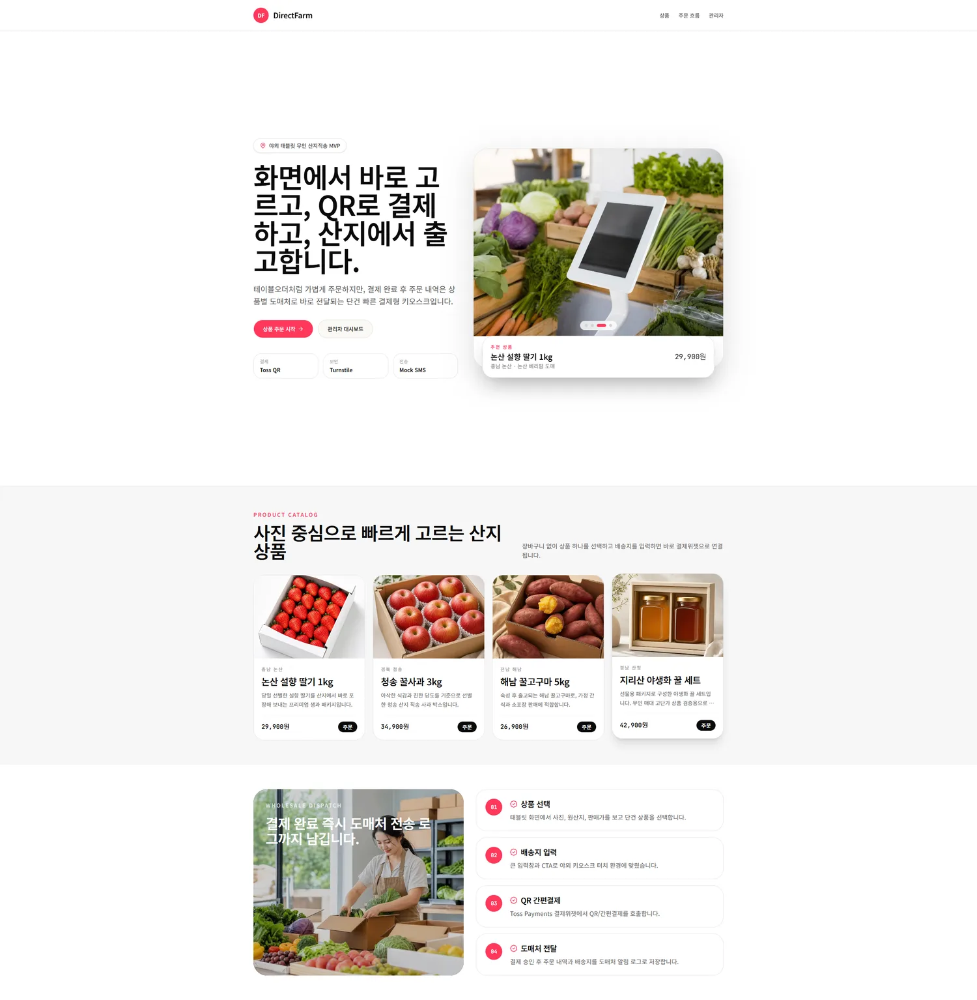
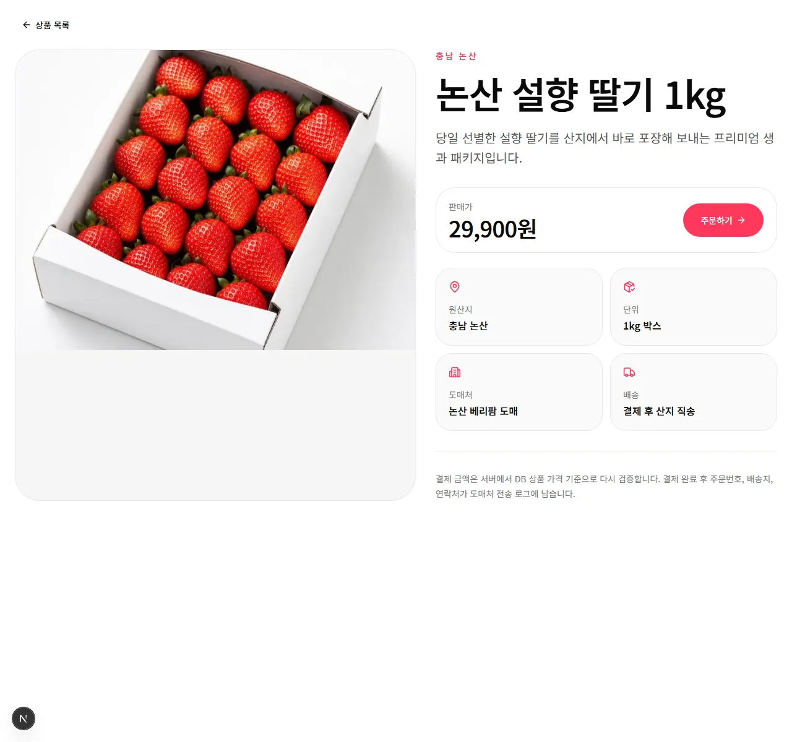
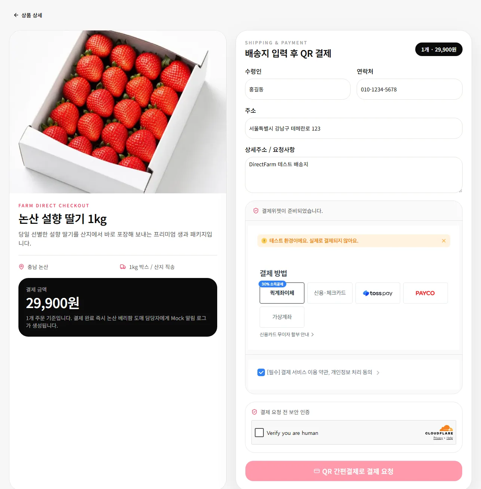
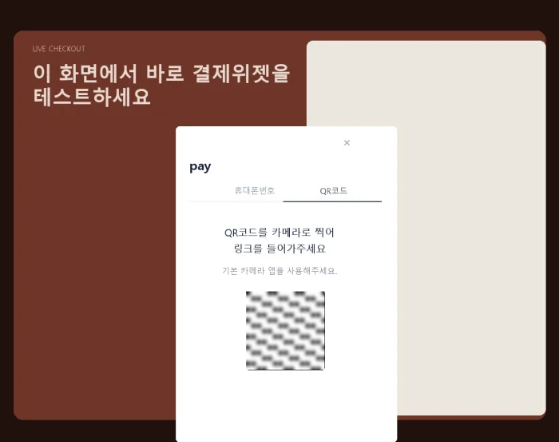
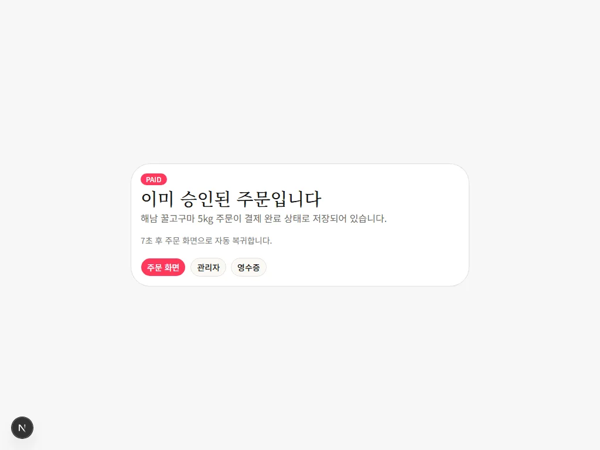
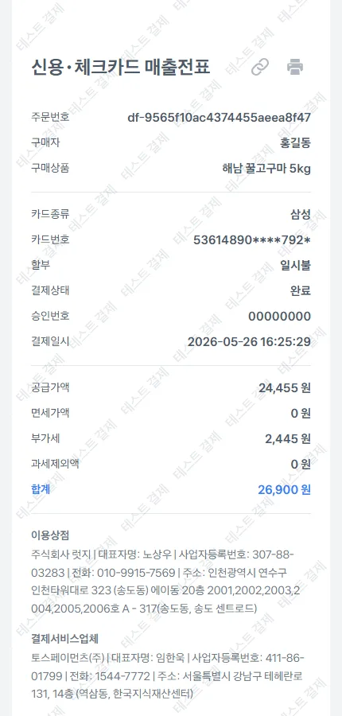
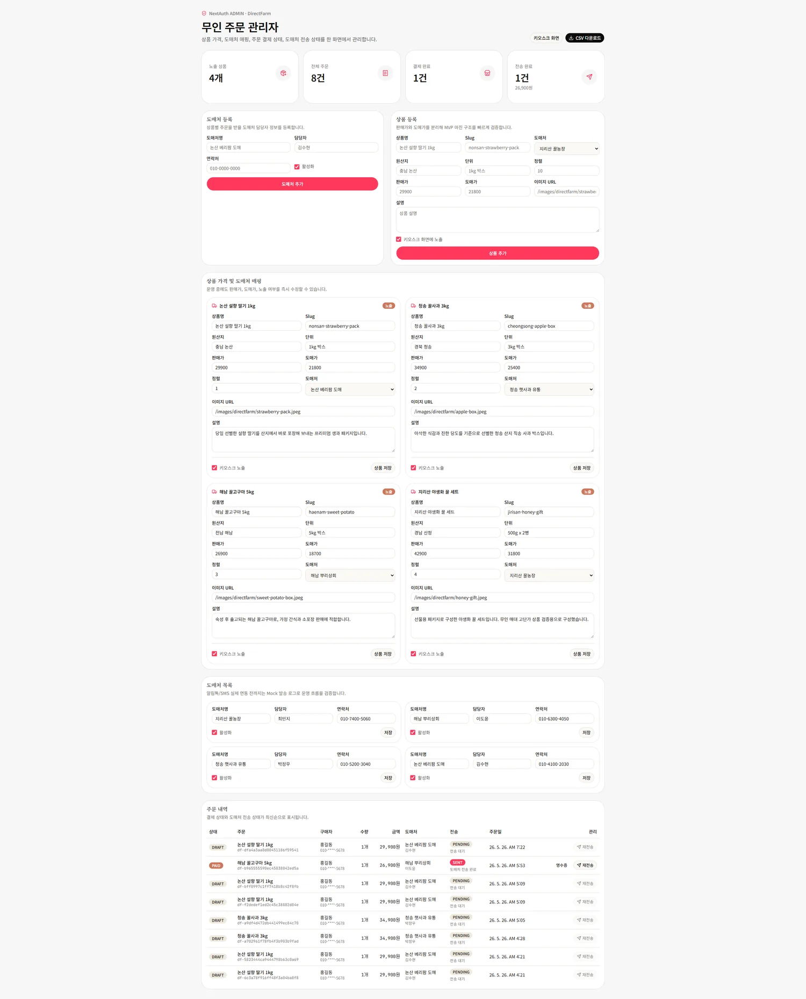
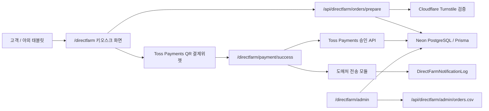

# DirectFarm

야외 태블릿 키오스크에서 고객이 상품을 선택하고 QR 간편결제로 결제하면, 결제 완료 주문이 도매처 전송 로그와 관리자 화면에 즉시 반영되는 산지직송 O2O 웹 플랫폼 MVP입니다.



## 공유 링크

- 키오스크 데모: https://tossops.bsclinic.xyz/directfarm
- 관리자 데모: https://tossops.bsclinic.xyz/directfarm/admin
- 제안/견적 리포트: https://tossops.bsclinic.xyz/directfarm/proposal
- PDF 리포트: https://tossops.bsclinic.xyz/docs/directfarm-estimate.pdf
- GitHub 저장소: https://github.com/nohsangwoo/Toss_Ops_Studio_ex

## 프로젝트 개요

DirectFarm은 유동인구가 많은 야외 공간에 설치된 태블릿에서 상품을 단건으로 빠르게 주문하고, 결제 완료 후 산지 또는 도매처가 직접 배송하는 운영 모델을 검증하기 위한 MVP입니다.

복잡한 장바구니와 자동 정산은 제외하고, 상품 선택, 배송지 입력, QR 결제, 주문 저장, 도매처 전송 로그, 관리자 상품/주문 관리를 먼저 검증할 수 있게 구성했습니다.

## 핵심 구현

- 태블릿 키오스크에 맞춘 사진 중심 상품 카탈로그
- 상품 클릭 시 팝업에서 상세 정보, 수량, 총 결제 금액 확인
- 같은 팝업 안에서 배송지 입력과 Toss Payments 결제위젯 확장
- Cloudflare Turnstile 기반 결제 요청 전 보안 인증
- Toss Payments QR 간편결제 호출 및 서버 승인 처리
- 결제 완료 후 `PAID` 주문 저장, 영수증 링크 제공
- 상품별 도매처 매핑 및 도매처 전송 로그 저장
- 관리자 상품/도매처/주문 관리, 재전송, CSV 다운로드
- DirectFarm 전용 Prisma 테이블로 기존 Toss Ops 데이터와 분리

## 화면 구성

### 1. 키오스크 홈과 상품 카탈로그

상품 이미지, 원산지, 단위, 가격이 먼저 보이도록 구성했습니다. 고객은 장바구니 없이 상품 하나를 선택하고 바로 결제 흐름으로 들어갑니다.


### 2. 상품 선택과 결제 전 확인

상품 카드를 누르면 페이지 이동 없이 팝업이 열리고, 수량 선택 후 총 결제 금액을 확인합니다.



### 3. 배송지 입력과 결제위젯

수령인, 연락처, 주소, 상세주소를 입력하고 Turnstile 인증을 통과하면 Toss Payments 결제 요청 버튼이 활성화됩니다.



### 4. QR 간편결제

실물 카드 단말기 대신 Toss Payments QR 결제창을 띄워 고객 휴대폰으로 결제를 이어갑니다.



### 5. 결제 완료와 영수증

결제 승인 후 주문 상태를 `PAID`로 저장하고, 완료 화면과 Toss Payments 매출전표 링크를 제공합니다.





### 6. 관리자 운영 화면

관리자는 상품, 판매가, 도매가, 도매처, 주문 상태, 결제 상태, 전송 상태를 한 화면에서 확인하고 운영할 수 있습니다.



## 사용자 흐름

1. 고객이 `/directfarm` 키오스크 화면에서 상품을 고릅니다.
2. 상품 팝업에서 수량과 총 결제 금액을 확인합니다.
3. 결제 진행을 누르면 배송지 입력 폼과 결제위젯이 확장됩니다.
4. Turnstile 인증 후 Toss Payments QR 간편결제를 호출합니다.
5. 결제 성공 시 서버에서 금액을 검증하고 결제를 승인합니다.
6. 주문 상태를 `PAID`로 저장하고 도매처 전송 로그를 생성합니다.
7. 완료 화면에서 주문 화면, 관리자 화면, 영수증으로 이동할 수 있습니다.

## 관리자 흐름

1. `ADMIN` 권한으로 `/directfarm/admin`에 접근합니다.
2. 상품명, 원산지, 단위, 판매가, 도매가, 이미지 URL을 등록/수정합니다.
3. 상품별 도매처를 매핑하고 담당자명, 연락처, 활성 상태를 관리합니다.
4. 주문 목록에서 결제 상태, 수량, 금액, 도매처, 전송 상태를 확인합니다.
5. 결제 완료 주문의 영수증을 확인하거나 도매처 전송을 재시도합니다.
6. 주문 목록을 Excel 호환 CSV로 다운로드합니다.

## 아키텍처



## 데이터 모델

- `DirectFarmVendor`: 도매처명, 담당자, 연락처, 활성 상태
- `DirectFarmProduct`: 상품명, slug, 이미지, 원산지, 단위, 판매가, 도매가, 도매처 매핑, 노출 상태
- `DirectFarmOrder`: 주문번호, 상품, 도매처, 구매자/배송지, 수량, 금액, 결제 상태, Toss paymentKey, 영수증 URL
- `DirectFarmNotificationLog`: 주문별 도매처 전송 채널, provider, payload, 전송 상태, 실패 메시지

## API

| API | 역할 |
| --- | --- |
| `POST /api/directfarm/orders/prepare` | 상품/수량/배송지/Turnstile 검증 후 주문 초안 생성 |
| `POST /api/directfarm/notifications/send` | 결제 완료 주문의 도매처 전송 로그 생성 또는 재전송 |
| `GET /api/directfarm/admin/orders.csv` | 관리자 주문 목록 CSV 다운로드 |

## 기술 스택

- Next.js 16 App Router
- React 19
- TypeScript
- Tailwind CSS v4
- shadcn/ui
- Prisma ORM
- Neon PostgreSQL
- NextAuth `ADMIN` Role
- Cloudflare Turnstile
- Toss Payments 결제위젯 및 REST API
- Vercel 배포

## 프로젝트 구조

```text
src/app/directfarm                  DirectFarm 화면 라우트
src/app/api/directfarm              DirectFarm API Routes
src/components/directfarm           키오스크/상품/결제 컴포넌트
src/lib/directfarm                  상품 데이터, 주문, 알림, 포맷 유틸
public/images/directfarm            상품/히어로/문서용 이미지
prisma/schema.prisma                DirectFarm 전용 모델
docs/projects/directfarm/README.md  공유용 DirectFarm README
```

## 실행 방법

```bash
npm install
npm run db:generate
npm run db:migrate
npm run db:seed
npm run dev
```

개발 서버:

```text
http://localhost:3000/directfarm
```

관리자 페이지:

```text
http://localhost:3000/directfarm/admin
```

데모 관리자 계정:

```text
admin@example.com / admin1234
```

## 환경 변수

```env
DATABASE_URL=
NEXTAUTH_URL=
NEXTAUTH_SECRET=
ADMIN_EMAIL=
ADMIN_PASSWORD=
NEXT_PUBLIC_TOSS_PAYMENTS_CLIENT_ID=
TOSS_PAYMENTS_SECRET_KEY=
NEXT_PUBLIC_TURNSTILE_SITE_KEY=
TURNSTILE_SECRET_KEY=
DIRECTFARM_NOTIFY_PROVIDER=mock
SOLAPI_API_KEY=
SOLAPI_API_SECRET=
ALIGO_API_KEY=
ALIGO_USER_ID=
```

## 검증 항목

- `/directfarm` 키오스크 화면 로딩
- 상품 팝업, 수량 선택, 결제위젯 확장
- Turnstile 토큰 누락 시 주문 생성 차단
- Toss QR 결제 호출
- 결제 성공 후 `PAID` 주문 저장
- 결제 완료 후 도매처 전송 로그 생성
- 관리자 상품/도매처 수정 후 키오스크 반영
- 관리자 주문 목록, 영수증 링크, 재전송, CSV 다운로드
- 기존 Toss Ops Studio 라우트와 데이터 영향 없음

## 확장 방향

- 실제 Solapi 또는 Aligo 알림톡/SMS 발송 연동
- 다중 키오스크 기기 식별자 추가
- 상품 재고/품절 상태 관리
- 복수 상품 장바구니와 묶음 배송
- 도매처별 자동 정산 리포트
- Firebase Auth/FCM 기반 회원/앱 확장
